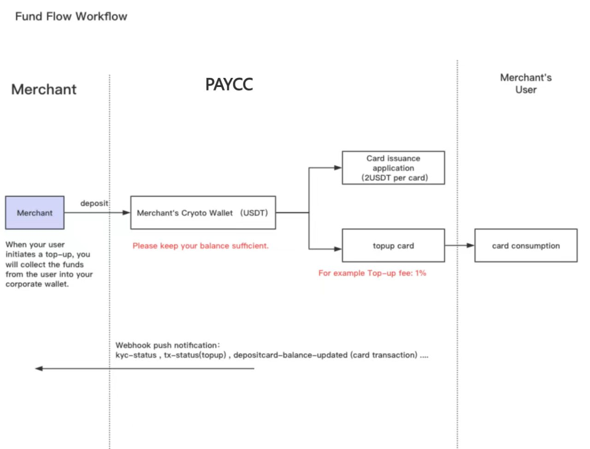
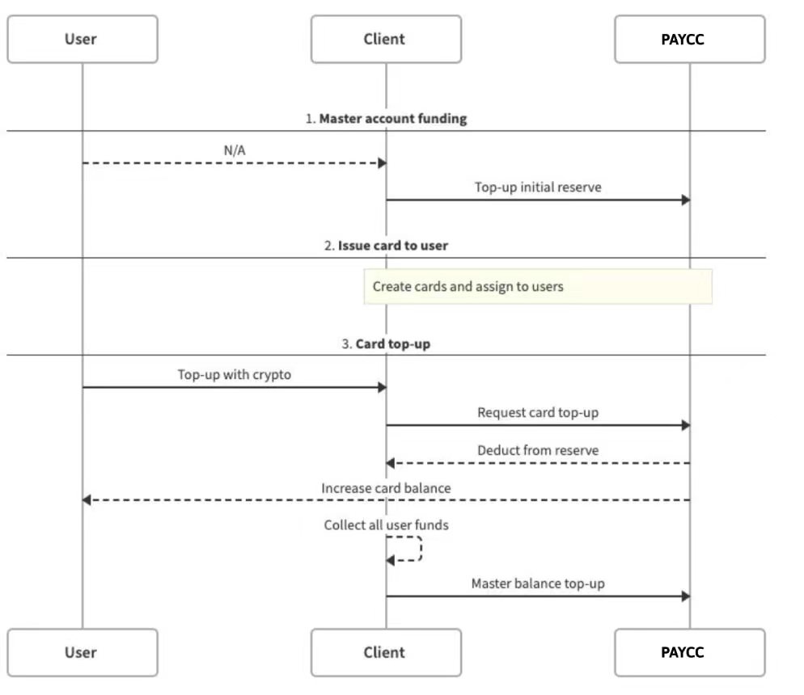

# Paycc API 文档

- [Paycc API](#Paycc-API)
- [接口规范](#接口规范)
* [FAQ (常见问题)](./paycc-api-FAQ.md)
- [1.机构](#机构)
     - [1.1 支持的卡种类查询](#支持的卡种类查询)
     - [1.2 查询机构余额](#查询机构余额)
     - [1.3 卡费率查询](#卡费率查询)
     - [1.4 估算将到账的法币金额](#估算将到账的法币金额)
     - [1.5 估算需要充值多少数字货币](#估算需要充值多少数字货币)
- [2.KYC](#KYC)
     - [2.1 提交用户 KYC 数据](#提交用户-KYC-数据)
     - [2.2 查询所有用户 KYC 记录](#查询所有用户-KYC-记录)
     - [2.3 查询指定用户 KYC 记录](#查询指定用户-KYC-记录)
- [3.开卡和激活](#开卡和激活)
     - [3.1 提交用户开卡申请](#提交用户开卡申请)
     - [3.2 用户激活卡片](#用户激活卡片)
     - [3.3 查询所有卡片状态](#查询所有卡片状态)
     - [3.4 查询指定用户所有卡片状态](#查询指定用户所有卡片状态)
- [4.充值卡](#充值卡)
     - [4.1 给用户卡充值](#给用户卡充值)
     - [4.2 查询币对价格](#查询币对价格)
     - [4.3 查询某笔卡充值交易状态](#查询某笔卡充值交易状态)
     - [4.4 查询所有卡充值记录](#查询所有卡充值记录)
     - [4.5 查询指定用户所有卡充值记录](#查询指定用户所有卡充值记录)
- [8.银行卡查询](#银行卡查询)
     - [8.1 查询卡是否激活](#查询卡是否激活)
     - [8.2 查询卡余额](#查询卡余额)
     - [8.3 查询卡账单](#查询卡账单)
     - [8.4 查询卡敏感信息](#查询卡敏感信息)
- [9.错误码](#错误码)
     - [9.1 业务逻辑错误码](#业务逻辑错误码)
     - [9.2 身份权限认证错误码](#身份权限认证错误码)
     - [9.3 异常错误码](#异常错误码)
     - [9.4 KYC失败错误码](#KYC失败错误码)

## Paycc-API

欢迎使用 Paycc API 文档。本文档是针对 Paycc ToB 的卡业务，目前支持实体卡、虚拟卡、共享卡，共几十个卡种类（不同卡BIN），不同卡种支持的法币和手续费不同，接口调用参数也略有差别。例如：


| 卡名 |  法币  |           区别            |
| :--------: | :----: | :------------------------------ |
|    J卡（card_type_id：30000001 - 30000009）     | USD | KYC审核48h以内，KYC填写只支持英文，mobile格式如 +8615821702552，卡片上会印用户的姓名，制卡时间1-2周。激活时必须提交手持卡片和护照的自拍照。到账时间4h内。 |
|   P卡（card_type_id：40000001 - 40000009）   | EUR       |         KYC时间1h以内，KYC填写只支持英文， mobile格式如 +86-15821702552，country、nationality填两位国家码。到账时间1h内。 |


API 使用步骤：

1. 请在 [https://customer.paycc.com/](https://customer.paycc.com/) 注册机构账户，如果访问不了请提供你的IP地址。
2. 我们审核通过后，机构才可以登录成功。
3. 机构登录，查看钱包地址，给钱包充值，支持 USDT、BTC、ETH 等。
4. 机构登录，创建 Appkey 和 secret，可选择配置 webhook 回调地址。
5. 调用 API 进行 KYC、开卡、激活卡、充值等操作，状态变更 Paycc 会通过回调地址通知机构服务器。




> 建议使用生产环境前先在测试环境调试。

机构 Dashboard :

* 测试环境（有IP白名单限制）: https://customer-sandbox.paycc.com/
* 生产环境（有IP白名单限制）: https://customer.paycc.com/

API 域名：

* 测试环境: https://api-sandbox.paycc.com/
* 生产环境: https://api.paycc.com/

## 接口规范

- Open API 请求都使用 `HMAC` 认证，以保证请求的完整性，真实性，同时做身份认证和鉴权。

- **分页**。查询记录列表都有分页，分页参数：`page_num` 表示页数，`page_size` 表示每页大小。接口 `DTO` 统一返回 `total`，`records`。

- **国家**。两位国家代码，参照 `ISO 3166-1 alpha-2` 编码标准

- 时间处理。API 请求和返回时间都是 `UNIX` 时间戳，**毫秒为单位**，避免因为时区导致误差

- 金额处理。API 请求和返回都是 `String` 字符串类型，避免精度丢失

- 所有带 `body` 的请求没有特殊说明body都是 `JSON`格式，`Content-Type：application/json`

- 所有查询接口查询时间间隔必须**小于一个月**

- 接口返回格式统一：

  | Parameter |  Type  |           Description            |
  | :--------: | :----: | :------------------------------ |
  |    code    |  int   |  错误码。`0`：正常，非`0`：异常  |
  |    msg     | String | 成功为 `SUCCESS`，失败为错误描述 |
  |   result   | Object |             返回信息             |

### HMAC认证

首先机构需要申请 API `Key` 和 API `Secret`，访问 API 时会用到。

| 名词 | 解释 |
| --- | --- |
| User ID | User ID 是用来标记你的开发者账号的， 是你的用户 ID|
| API Key & API Secret| User ID 下面管理了多个 API Key + API Secret， API Key 对应你的应用，你可以有多个应用，每个应用可以申请不同的  API 权限|

#### 客户端实现流程：

1. 构造需要签名的 data ，包括
   - UNIX 时间戳，`毫秒为单位`：`request` time stamp
   - 请求方法：`HTTP` method
   - 请求 API Key： Api Key
   - 完整的请求路径，包括 `URL` 问号后的参数：request URI
   - 如果有请求 `body`，再加上请求 `body` 转换后的`字符串`：string representation of the request payload
2. 客户端根据签名 data 和 API Secret 使用 `HMAC_SHA256` 算法生成签名 signature。
3. 按照指定顺序设置 Authorization header，即 key 是：`Authorization`， value 是：Railone:ApiKey:request time stamp:signature（以冒号拼接）。
4. 如果在服务端创建 API Key，API Secret 时使用了密码，则需要设置 Access-Passphrase header，即 `key` 是：`Access-Passphrase`，`value` 是：当时设置的密码。
5. 客户端发送数据和 Authorization header，以及 Access-Passphrase header（如果有第四步的话）到服务端。即最终发送的 http header 为：
   - Authorization:Railone:ApiKey:request timestamp:signature
   - Access-Passphrase:Your API Secret passphrase


#### 如何构造待签名的请求body string：

请求 body 需要按照 `ASCII` 码的顺序对参数名进行排序，以  `=` 拼接 key 和 value，并以 `&` 分割多个 key-value，转换成字符串。

例如请求 `body` 为：

```
{
	"from_address":"Ae9ujqUnAtH9yRiepRvLUE3t9R2NbCTZPG",
	"amount":190,
	"to_address":"AUol16ghiT9AtxRDtNeq3ovhWJ5iaY6iyd"
}
```

转换后为：

```text
amount=190&from_address=Ae9ujqUnAtH9yRiepRvLUE3t9R2NbCTZPG&to_address=AUol16ghiT9AtxRDtNeq3ovhWJ5iaY6iyd
```


## 机构


### 支持的卡种类查询

```text
url：/api/v1/institution/card/type
method：GET
```

| Parameter  | Type |Requirement  | Description |
| :------------: | :----: | :----------: |:---------- |
|  page_num   | int  |    选填|页数     |
|  page_size  | int  |  选填|页的大小   |

- 响应:

```json
{
    "code": 0,
    "msg": "SUCCESS",
    "result": {
        "total": 2,
        "records": [
            {
                "card_type_id": "50000001",
                "currency_type": "USD",
                "bank_id": "5000",
                "description": "card 1",
                "card_network": "visa",
                "card_title": "F",
                "virtual_card": false
            },
            {
                "card_type_id": "50000002",
                "currency_type": "USD",
                "bank_id": "5000",
                "description": "card 2",
                "card_network": "visa",
                "card_title": "F-V",
                "virtual_card": true
            }
        ]
    }
}
```

| Parameter |  Type  |          Description          |
| :--------: | :----: | :------------------------------ |
| card_type_id |String |银行卡种类对应的id,比如 50000001|
| currency_type |String |卡支持的法币类型|
|   bank_id   | String |        银行ID           |
|   description   | String |    卡种描述           |
|   card_network   | String |    发卡机构：visa、master、unionpay           |
|   virtual_card   | Bool |    是否是虚拟卡           |
|   card_title   | String |    支持F卡、J卡、P卡等，对应的金属卡是F-M*卡、J-M*卡、P-M*卡，对应的虚拟卡是F-V卡、J-V卡、P-V卡           |

### 查询机构余额

- Request:

```text
url：/api/v1/institution/balance
method：GET
```

- Response:

```
{
    "code": 0,
    "msg": "SUCCESS",
    "result": [
        {
            "addresses":[
                {
                    "balance":"100",
                    "address_type":"deposit",
                    "address":"0x0e420097975b6c700f6314914a1b6e66a1edc313"
                },
                {
                    "balance":"200",
                    "address_type":"open_card",
                    "address":"0x88fee6dda9a041e9ebe6c56924765ff54544e40c"
                }],
            "coin_type":"USDT"
        }
    ]
}
```

|         Parameter         |  Type  | Description                        |
| :-----------------------: | :----: | :--------------------------------- |
|         coin_type         | String | 数字货币类型                             |
|   addresses[0].balance    | String | 数字货币余额                             |
| addresses[0].address_type | String | 数字货币地址类型，开卡（open_card）和充值（deposit） |
|   addresses[0].address    | String | 数字货币地址                             |
|                           |        |                                    |

### 卡费率查询

```text
url：/api/v1/institution/rates?card_type_id={card_type_id}
method：GET
```

- 请求：

| Parameter |  Type  |   Requirement  | Description   |
| :------------: | :----: | :----------: |:---------- |
| card_type_id |String |必填 |银行卡种类对应的id,比如 50000001|

- 响应：

```json
{
    "code": 0,
    "msg": "SUCCESS",
    "result": {
        "exchange_rate": "1.00505392692",
        "card_application_fee": "1",
        "min_deposit":"0",
        "max_deposit":"10000",
        "loading_rate": [
            {
                "min": "0",
                "max": "1000",
                "step_rate": "0.05"
            },
            {
                "min": "1000",
                "max": "2000",
                "step_rate": "0.03"
            }
        ],
        "bank_atm_fee": "0",
        "bank_atm_rate": "0.1",
        "bank_transaction_rate": "0.2"
    }
}
```

|       Parameter       |  Type  | Description                     |
| :-------------------: | :----: | :------------------------------ |
| card_application_fee  | String | 开卡的手续费（USDT）                    |
|      min_deposit      | String | 单笔最小充值金额（法币）                    |
|      max_deposit      | String | 单笔最大充值金额（法币）                    |
|     exchange_rate     | String | USDT兑换相应法币的汇率                   |
|     loading_rate      | String | 给用户充值时付给 Paycc 的阶梯费率，大部分卡只有一阶费率 |
| bank_transaction_rate | String | 银行卡刷卡消费的手续费率                    |
|     bank_atm_rate     | String | ATM取款时的手续费率                     |
|     bank_atm_fee      | String | ATM取款时的固定手续费                    |


### 估算将到账的法币金额

- Request:

```text
内扣 url：/api/v1/institution/estimation/currency
外扣 url：/api/v1/institution/estimation/currency/external-deduction
method：POST
```

|  Parameter  | Type  | Whether Required |                        Description                         |
| :---------: | :---: | :--------------: | :-------------------------------------------------------- |
|  coin_amount  |  String  |    Required     |  充值的数字货币金额     |
| coin_type  |  String  |    Required     |  充值的数字货币类型，USDT     |
|  card_type_id  |  String  |    Required     |  卡种ID    |

- Response:

```
{
    "code": 0,
    "msg": "SUCCESS",
    "result": {
        "coin_type": "usdt",
        "coin_amount": "106.23",
        "currency_type": "usd",
        "currency_amount": "94.13",
        "exchange_rate": "1.00145966373",
        "fiat_exchange_rate": "1",
        "exchange_fee": "1.0623",
        "exchange_fee_rate": "0.01",
        "loading_fee": "5.3115",
        "coin_price": "1"
    }
}
```

|     Parameter      |  Type  | Description                  |
| :----------------: | :----: | :--------------------------- |
|    coin_amount     | String | 充值的数字货币金额                    |
|     coin_type      | String | 充值的数字货币类型                    |
|  currency_amount   | String | 充值到账的法币金额                    |
|   currency_type    | String | 充值到账的法币类型                    |
|    exchange_fee    | String | 其他币种兑换USDT的手续费，单位是 coin_type |
| exchange_fee_rate  | String | 其他币种兑换USDT的手续费率              |
|    loading_fee     | String | 充值手续费，单位是 coin_type          |
|   exchange_rate    | String | USDT/USD 汇率                  |
| fiat_exchange_rate | String | 卡支持的法币/USD 汇率                |
|     coin_price     | String | coin_type/USDT 价格            |

> (currency_amount * fiat_exchange_rate) = ((coin_amount - exchange_fee - loading_fee) * coin_price) * exchange_rate 
> 总到账USD = 实际充值USDT * exchange_rate（USDT/USD）

### 估算需要充值多少数字货币

- Request:

```text
url：/api/v1/institution/estimation/crypto
method：POST
```
- Request:

|  Parameter  | Type  | Whether Required |                        Description                         |
| :---------: | :---: | :--------------: | :--------------------------------------------------------|
|  currency_amount  |  String  |    Required     |  需要充值到账的法币金额     |
|  card_type_id  |  String  |    Required     |  卡种ID    |
|  coin_type  |  String  |    Required     |  需要换算的数字货币类型，usdt    |

- Response:

```
{
    "code": 0,
    "msg": "SUCCESS",
    "result": {
        "coin_type": "usdt",
        "coin_amount": "106.23",
        "currency_type": "usd",
        "currency_amount": "94.13",
        "exchange_rate": "1.00145966373",
        "fiat_exchange_rate": "1",
        "exchange_fee": "1.0623",
        "exchange_fee_rate": "0.01",
        "loading_fee": "5.3115",
        "coin_price": "1"
    }
}
```

|    Parameter    |  Type   |      Description          |
| :---------: | :----:   | :--------------------------- |
|  coin_amount    | String  |    需要的数字货币金额         |
|  coin_type  |  String    |  需要的数字货币类型    |
|  currency_amount    | String  |    充值到账的法币金额          |
|  currency_type  |  String    |  充值到账的法币类型    |
| exchange_fee    | String  |   其他币种兑换USDT的手续费，单位是 coin_type            |
| exchange_fee_rate    | String  |   其他币种兑换USDT的手续费率           |
|  loading_fee    | String  |       充值手续费，单位是 coin_type       |
| exchange_rate    | String  | USDT/USD 汇率             |
| fiat_exchange_rate    | String  | 卡支持的法币/USD 汇率              |
| coin_price    | String  | coin_type/USDT 价格              |

> (currency_amount * fiat_exchange_rate) = ((coin_amount - exchange_fee - loading_fee) * coin_price) * exchange_rate 
> 总到账USD = 实际充值USDT * exchange_rate（USDT/USD）


## KYC

提供给机构使用的接口，如机构为用户创建KYC、查询KYC记录等。

### 提交用户 KYC 数据

如果KYC审核失败，也使用这个接口重新提交。

```text
url：/api/v1/customers/accounts
method：POST
```


- 请求：

|       Parameter        |   Type    | Requirement | Description                                          |
| :--------------------: | :-------: | :---------: | :--------------------------------------------------- |
|        acct_no         |  String   |     必填      | 机构端用户编号(机构端唯一)，字符长度最大64                              |
|       acct_name        |  String   |     必填      | 机构端用户名，字符长度最大64                                      |
|       first_name       |  String   |     必填      | 真实用户名，字符长度最大50                                       |
|       last_name        |  String   |     必填      | 真实用户姓，字符长度最大50                                       |
|         gender         |  String   |     必填      | male:男，female:女，unknown:其他，字符长度最大6                   |
|        birthday        |  String   |     必填      | 生日（生日格式为"1990-01-01"）                                |
|          city          |  String   |     必填      | 城市，字符长度最大100                                         |
|         state          |  String   |     必填      | 省份，字符长度最大100                                         |
|        country         |  String   |     必填      | 用户所在国家，字符长度最大50                                      |
|      nationality       |  String   |     必填      | 国籍，字符长度最大255                                         |
|         doc_no         |  String   |     必填      | 证件号码，字符长度最大128                                       |
|        doc_type        |  String   |     必填      | 证件类型(目前只支持passport): passport: 护照，idcard：身份证，字符长度最大8 |
|       front_doc        |  String   |     必填      | 正面照。base64编码, 照片文件大小应小于2M                            |
|        back_doc        |  String   |     选填      | 反面照，doc_type是idcard时必须填写。base64编码，照片文件大小应小于2M        |
|        mix_doc         |  String   |     必填      | 手持证件照。base64编码，照片文件大小应小于2M                           |
|      country_code      |  String   |     必填      | 手机国际区号，如“+86”。字符长度最大5                                |
|         mobile         |  String   |     必填      | 手机号，字符长度最大32                                         |
|          mail          |  String   |     必填      | 邮箱，不支持163.com的邮箱。字符长度最大64                            |
|        address         |  String   |     必填      | 通讯地址，银行卡会寄到该地址。字符长度最大256                             |
|        zipcode         |  String   |     必填      | 邮编，字符长度最大20                                          |
|      card_type_id      |  String   |     必填      | 银行卡种类对应的id,比如 10010001                               |
|      maiden_name       |  String   |     选填      | 妈妈的名字（可以填no），字符长度最大255                               |
|        kyc_info        |  String   |     选填      | KYC 其他信息                                             |
| mail_verification_code |  String   |     选填      | 邮箱验证码                                                |
|       mail_token       |  String   |     选填      | 发送邮件后返回的token                                        |
|       cust_tx_id       |  String   |     选填      | KYC流水号                                               |
|        sign_img        |  String   |     选填      | 签名照片。base64编码，照片文件大小应小于1M                            |
|        poa_doc         | String[3] |     选填      | 地址证明照片（暂不支持）。base64编码，照片或PDF文件每个文件大小应小于2M            |
|      card_number       |  String   |     选填      | 特殊卡种支持，绑卡卡号，用于提前售卡，Native实体卡必填                       |
|   print_name_on_card   |   Bool    |     选填      | 是否印名，Native实体卡必填                                     |

- 响应：

```json
{
  "code": 0,
  "msg": "string",
  "result": true
}
```


### 查询所有用户 KYC 记录

```text
url：/api/v1/customers/accounts
method：GET
```

| Parameter  | Type |Requirement  | Description |
| :------------: | :----: | :----------: |:---------- |
|  page_num   | int  |    选填|页数     |
|  page_size  | int  |  选填|页的大小   |
| former_time | long |  选填|前置时间, UNIX 时间戳，`秒为单位`   |
| latter_time | long | 选填|后置时间, UNIX 时间戳，`秒为单位`   |
| time_sort | String | 选填|时间排序, asc为升序，desc为降序   |


- 响应：

```json
{
  "code": 0,
  "msg": "SUCCESS",
  "result": {
    "total": 1,
    "records": [
      {
        "acct_no": "1222",
        "card_type_id": "10010001",
        "status": 3,
        "face_recognition_url": "https://www.hh.io", //认证中才可能有活体认证链接
        "reason": "{\"code\":1110032,\"msg\":\"KYC failure, photo error\"}",
        "create_time": 1546300800000
      }
    ]
  }
}
```


| Parameter  |  Type  |                     Description                     |
| :--------: | :----: | :------------------------------ |
|   acct_no   | String |             机构端用户编号(机构端唯一)              |
| card_type_id |String |卡种对应的id|
|   status    |  int   | 状态码: 0 已提交， 1 认证通过(开卡成功)， 2 认证未通过， 3 认证中， 4 提交信息处理中 6 已退款|
|   reason   | String | 认证失败原因。其他情况为空字符串 |
| create_time |  long  |                      创建时间                       |

> 失败原因请查看KYC失败错误码

### 查询指定用户 KYC 记录

```text
url：/api/v1/customers/accounts
method：GET
```

- 请求：

| Parameter  | Type |Requirement  | Description |
| :------------: | :----: | :----------: |:---------- |
|    acct_no     | String | 必填|机构用户的唯一id号 |
|  page_num   | int  |    选填|页数     |
|  page_size  | int  |  选填|页的大小   |
| former_time | long |  选填|前置时间, UNIX 时间戳，`秒为单位`   |
| latter_time | long | 选填|后置时间, UNIX 时间戳，`秒为单位`   |
| time_sort | String | 选填|时间排序, asc为升序，desc为降序   |

- 响应：

```json
{
  "code": 0,
  "msg": "SUCCESS",
  "result": {
    "total": 1,
    "records": [
      {
        "acct_no": "1222",
        "card_type_id": "10010001",
        "status": 3,
        "face_recognition_url": "https://www.hh.io", //认证中才可能有活体认证链接
        "reason": "{\"code\":1110032,\"msg\":\"KYC failure, photo error\"}",
        "create_time": 1546300800000
      }
    ]
  }
}
```


| Parameter  |  Type  |                     Description                     |
| :--------: | :----: | :------------------------------ |
|   acct_no   | String |             机构端用户编号(机构端唯一)              |
| card_type_id |String  |卡种对应的id|
|   status    |  int   | 状态码: 0 已提交， 1 认证通过(开卡成功)， 2 认证未通过， 3 认证中， 4 提交信息处理中  6 已退款 |
|   reason   | String | 认证失败原因。其他情况为空字符串 |
| create_time |  long  |                      创建时间                       |


> 失败原因请查看KYC失败错误码


### 查询指定用户 KYC 信息

```text
url：/api/v1/customers/accounts/kyc
method：GET
```

- 请求：

| Parameter  | Type |Requirement  | Description |
| :------------: | :----: | :----------: |:---------- |
|    acct_no     | String | 必填|机构用户的唯一id号 |

- 响应：

```
{
  "code": 0,
  "msg": "SUCCESS",
  "result": {
    "total": 1,
    "records": [
      {
        "acct_no": "1222",
        ......
      }
    ]
  }
}
```

| Parameter |  Type    |Description   |
| :------------: | :----:  |:---------- |
|   acct_no | String | 机构端用户编号(机构端唯一)，字符长度最大64位|
|   acct_name | String  |机构端用户名，字符长度最大64位|
|   first_name | String  |真实用户名，字符长度最大50位|
|   last_name | String  |真实用户姓，字符长度最大50位|
|   gender | String  |male:男，female:女，unknown:其他，字符长度最大6位|
|   birthday | String  |生日（生日格式为"1990-01-01"）|
|   city | String  |城市，字符长度最大100位|
|   state | String  |省份，字符长度最大100位|
|   country | String  |用户所在国家，字符长度最大50位|
|   nationality | String  |国籍，字符长度最大255位|
| doc_no | String  |证件号码，字符长度最大128位|
| doc_type | String  |证件类型(目前只支持passport): passport: 护照，idcard：身份证，字符长度最大8位|
|   country_code | String |手机国际区号，如“+86”。字符长度最大5位|
|   mobile | String  |手机号，字符长度最大32位|
|  mail | String  |邮箱，不支持163.com的邮箱。字符长度最大64位|
|   address | String  |通讯地址，银行卡会寄到该地址。字符长度最大256位|
|   zipcode | String  |邮编，字符长度最大20位|
|   maiden_name | String  |妈妈的名字，字符长度最大255位|
| card_type_id |String  |银行卡种类对应的id,比如 10010001|
|   kyc_info | text  |KYC 其他信息|
| cust_tx_id | String | KYC流水号|
|   status    |  int   | 状态码: 0 已提交， 1 认证通过(开卡成功)， 2 认证未通过， 3 认证中， 4 提交信息处理中 6 已退款|


## 开卡和激活

提供机构给用户开卡，记录查询等接口。

### 提交用户开卡申请

```text
url：/api/v1/debit-cards
method：POST
```

- 请求

| Parameter |  Type  |   Requirement  |Description   |
| :------------: | :----: | :----------: |:---------- |
| acct_no | String | 必填|机构端用户编号(机构端唯一)|
| card_type_id |String |必填 |卡种对应的id|
| card_number |String |可选 |支持绑卡的卡种才需要填写。用户自己填写卡号绑卡|
| urn |String |可选 |支持绑卡的卡种才需要填写。信封号|


- 响应：

```json
{
  "code": 0,
  "msg": "string",
  "result": {
 	"card_no": "xxxx",
	"card_number": "430021******1144",
	"status": 2
  }
}
```

| Parameter |  Type  |          Description          |
| :--------: | :----: | :------------------------------ |
|   card_no   | String |           分配的银行卡ID，查询时用card_no，避免真是卡号信息泄露。生成规则：机构id+5位随机数 +卡种id +卡最后四位           |
|   card_number   | String |           分配的真实银行卡号, 只显示前6位和后4位           |
|   status   | int |   状态：2. 开卡申请成功(未激活)， 5. 申请失败(卡片正在制作中，请过会再申请)           |

### 用户激活卡片

虚拟卡激活成功后，通过银行接口查卡信息可以拿到真实卡号、cvv、过期时间。

```text
url：/api/v1/debit-cards/status
method：PUT
```

- 请求

| Parameter |  Type  |   Requirement  |     Description         |
| :------------: | :----: | :----------: |:---------- |
|    card_no     | String |      必填    |银行卡ID          |
| acct_no | String | 必填    |机构端用户编号(机构端唯一) |
| cvv |String |可选 | 有的实体卡激活时需要提交cvv |


- 响应：

```json
{
  "code": 0,
  "msg": "string",
  "result": {
    "card_type_id":"72000001",
    "card_no":"4360396720000016920",
    "acct_no":"test20240529",
    "status":1
  }
}
```

| Parameter  |  Type  |             Description             |
| :--------: | :----: | :------------------------------ |
|   acct_no   | String |     机构端用户编号(机构端唯一)      |
|   card_type_id   | String |     卡类型ID     |
|   card_no   |  int   |              卡ID               |
|   status    |  int   | 状态码: 0 冻结， 1 激活成功， 2未激活， 3. 激活待审核， 4. 激活审核失败,  5. 申请失败(卡片正在制作中，请过会再申请) 6.已注销 |


### 查询所有卡片状态

```text
url：/api/v1/debit-cards
method：GET
```

| Parameter  | Type | Requirement  |Description |
| :------------: | :----: | :----------: |:---------- |
|  page_num   | int  |    选填    |页数     |
|  page_size  | int  |  选填    |页的大小   |
| former_time | long |  选填    |前置时间, UNIX 时间戳，`秒为单位`   |
| latter_time | long |  选填    |后置时间, UNIX 时间戳，`秒为单位`   |
| time_sort | String | 选填|时间排序, asc为正序，desc为反序   |

- 响应：

```json
{
    "code": 0,
    "msg": "SUCCESS",
    "result": {
        "total": 1,
        "records": [
            {
                "acct_no": "1",
                "card_type_id":"72000001",
                "card_no": "4385211202597301",
                "status": 4,
                "reason": "{\"code\":1110061,\"msg\":\"Activation failure, hand holding card is not plastic card\"}",
                "create_time": 1576847136000
            }
        ]
    }
}
```


| Parameter  |  Type  |             Description             |
| :--------: | :----: | :------------------------------ |
|   acct_no   | String |     机构端用户编号(机构端唯一)      |
|   card_type_id   | String |     卡类型ID     |
|   card_no   |  int   |              银行卡号               |
|   status    |  int   | 状态码: 0 冻结， 1 激活成功， 2未激活， 3. 激活待审核， 4. 激活审核失败,  5. 申请失败(卡片正在制作中，请过会再申请) 6.已注销 |
|   reason   | String | 激活失败原因。其他情况为空字符串 |
| create_time |  long  |              创建时间               |


### 查询指定用户所有卡片状态

```text
url：/api/v1/debit-cards?acct_no={acct_no}
method：GET
```

- 请求：

| Parameter  | Type | Requirement  |Description |
| :------------: | :----: | :----------: |:---------- |
|   acct_no   | String |    必填 |机构端用户编号(机构端唯一)      |
|  page_num   | int  |    选填    |页数     |
|  page_size  | int  |  选填    |页的大小   |
| former_time | long |  选填    |前置时间, UNIX 时间戳，`秒为单位`   |
| latter_time | long |  选填    |后置时间, UNIX 时间戳，`秒为单位`   |
| time_sort | String | 选填|时间排序, asc为正序，desc为反序   |


- 响应：

```json
{
    "code": 0,
    "msg": "SUCCESS",
    "result": {
        "total": 1,
        "records": [
            {
                "acct_no": "1",
                "card_type_id":"72000001",
                "card_no": "4385211202597301",
                "status": 4,
                "reason": "{\"code\":1110061,\"msg\":\"Activation failure, hand holding card is not plastic card\"}",
                "create_time": 1576847136000
            }
        ]
    }
}
```

| Parameter  |  Type  |             Description             |
| :--------: | :----: | :------------------------------ |
|   acct_no   | String |     机构端用户编号(机构端唯一)      |
|   card_type_id   | String |     卡类型ID     |
|   card_no   |  int   |              银行卡ID               |
|   status    |  int   | 状态码: 0 冻结， 1 激活成功， 2未激活， 3. 激活待审核， 4. 激活审核失败, 5. 申请失败(卡片正在制作中，请过会再申请)|
|   reason   | String | 激活失败原因。其他情况为空字符串 |
| create_time |  long  |              创建时间               |

## 充值卡

### 给用户卡充值

```text
内扣 url：/api/v1/deposit-transactions
外扣 url：/api/v1/deposit-transactions/external-deduction
method：POST
```

- 请求：

|   Parameter   |  Type  | Requirement | Description     |
| :-----------: | :----: | :---------: | :-------------- |
|    card_no    | String |     必填      | 银行卡ID           |
|    acct_no    | String |     必填      | 机构端用户编号(机构端唯一)  |
|    amount     | String |     必填      | 充值对应币种的金额       |
|   coin_type   | String |     必填      | 币种。只支持USDT、RUSD |
|  cust_tx_id   | String |     必填      | 机构的交易流水号        |
|    remark     | String |     选填      | 交易备注            |
| card_currency | String |     选填      | 卡币种，双币种卡才需要填写   |

- 响应：

```json
{
    "code": 0,
    "msg": "SUCCESS",
    "result": {
        "tx_id": "2020022511324811001637548",
        "coin_type": "USDT",
        "tx_amount": "0.92",         
        "exchange_fee_rate": "0",
        "exchange_fee": "0",
        "loading_fee": "0.0812",        
        "deposit_usdt": "0.9188",
        "currency_type": "USD",
        "currency_amount": "0.92",
        "exchange_rate": "1.00239251357",
        "fiat_exchange_rate": "1"
    }
}
```

| Parameter |  Type    | Description |
| :------------: | :----------: |:---------- |
|     tx_id      | String |  交易流水id  |
|    coin_type    | String | 充值币种       |
|    tx_amount      | String | 充值币种对应的金额         |
|     deposit_usdt      | String | 扣除手续费后,为用户充值的coin_type数量，单位是coin_type   |
|     exchange_fee_rate      | String | 充值币种兑换成coin_type的费率   |
|     exchange_fee      | String | 充值币种兑换成USDT的费用，单位是coin_type  |
|     loading_fee      | String | 充值手续费，单位是coin_type   |
|     currency_amount      | String | 到账法币数量  |
|     currency_type      | String | 到账法币类型  |
|     exchange_rate      | String | coin_type/USD汇率  |
|     fiat_exchange_rate      | String | 卡支持的法币/USD汇率  |

> 如果coin_type是USDT，从机构扣的USDT费用 = exchange_fee + loading_fee + deposit_usdt。

### 查询某笔卡充值交易状态

```text
url：/api/v1/deposit-transactions/{tx_id}/status
method：GET
```

- 请求：

| Parameter |  Type  |Requirement  | Description |
| :------------: | :----: | :----------: |:---------- |
|     tx_id      | String | 必填| 交易流水 tx_id 或 cust_tx_id  |

- 响应：

```json
{
  "code": 0,
  "msg": "string",
  "result": {
                "cust_tx_id": "1223",
                "acct_no": "03030062",
                "card_no": "8993152800000013334",
                "cust_tx_time": 1584350913000,
                "tx_id": "2020031609283339501898843",
                "coin_type": "USDT",
                "tx_amount": "61.86",     
                "exchange_fee": "0",
                "loading_fee": "1.8558",
                "currency_type": "USD",                
                "currency_amount": "60",
                "exchange_rate": "1.00239251357",
                "fiat_exchange_rate": "1",
                "tx_status": 3,
                "coin_price": "1"
  }
}
```

|  Parameter   |  Type  |        Description         |
| :--------: | :----: | :------------------------------ |
|  cust_tx_id   | String |         机构流水号         |
|    acct_no    | String | 机构端用户编号(机构端唯一) |
|    card_no    |  int   |          银行卡ID         |
|  cust_tx_time  |  long  |          创建时间          |
|  tx_id   | String |        交易id         |
|    coin_type    |  int   |          充值币种          |
|   tx_amount   | String |          充值金额          |
|  exchange_fee   | String |     充值币种兑换成USDT的费用，单位是 ```coin_type```   |
|      loading_fee      | String |  充值手续费，单位是 ```coin_type```           |
|     currency_type      | String | 到账法币类型  |
|     currency_amount      | String | 到账法币数量  |
| exchange_rate | String |            USDT/USD汇率            |
|   fiat_exchange_rate      | String | 卡支持的法币/USD汇率  |
|  tx_status   | int |   交易状态。0、3、4:待处理中，1:充值成功，2充值失败，5:充值失败        |
|   coin_price      | String | coin_type/USD汇率  |

### 查询所有卡充值记录

```text
url：/api/v1/deposit-transactions
method：GET
```

| Parameter  | Type | Requirement  |Description |
| :------------: | :----: | :----------: |:---------- |
|  page_num   | int  |    选填|页数     |
|  page_size  | int  |  选填|页的大小   |
| former_time | long |  选填|前置时间, UNIX 时间戳，`秒为单位`   |
| latter_time | long |  选填|后置时间, UNIX 时间戳，`秒为单位`   |
| time_sort | String | 选填|时间排序, asc为正序，desc为反序   |

- 响应：

```json
{
    "code": 0,
    "msg": "SUCCESS",
    "result": {
        "total": 1,
        "records": [
            {
                "cust_tx_id": "1223",
                "acct_no": "03030062",
                "card_no": "8993152800000013334",
                "cust_tx_time": 1584350913000,
                "tx_id": "2020031609283339501898843",
                "coin_type": "USDT",
                "tx_amount": "61.86",     
                "exchange_fee": "0",
                "loading_fee": "1.8558",
                "currency_type": "USD",                
                "currency_amount": "60",
                "exchange_rate": "1.00239251357",
                "fiat_exchange_rate": "1",
                "tx_status": 3,
                "coin_price": "1"
            }
        ]
    }
}
```

|  Parameter   |  Type  |        Description         |
| :--------: | :----: | :------------------------------ |
|  cust_tx_id   | String |         机构流水号         |
|    acct_no    | String | 机构端用户编号(机构端唯一) |
|    card_no    |  int   |          银行卡ID         |
|  cust_tx_time  |  long  |          创建时间          |
|  tx_id   | String |        交易id         |
|    coin_type    |  int   |          充值币种          |
|   tx_amount   | String |          充值金额          |
|  exchange_fee   | String |     充值币种兑换成USDT的费用，单位是 ```coin_type```    |
|      loading_fee      | String |  充值手续费，单位是 ```coin_type```           |
|     currency_type      | String | 到账法币类型  |
|     currency_amount      | String | 到账法币数量  |
| exchange_rate | String |            USDT/法币汇率            |
|   fiat_exchange_rate      | String | 卡支持的法币/USD汇率  |
|  tx_status   | int |   交易状态。0、3、4:待处理中，1:充值成功，2、5:充值失败         |
|   coin_price      | String | coin_type/USD汇率  |


### 查询指定用户所有卡充值记录

```text
url：/api/v1/deposit-transactions?acct_no={acct_no}
method：GET
```

- 请求：

| Parameter |  Type  | Requirement  |Description |
| :------------: | :----: | :----------: |:---------- |
|    acct_no     | String | 必填|机构用户的唯一id号 |
|  page_num   | int  |    选填|页数     |
|  page_size  | int  |  选填|页的大小   |
| former_time | long |  选填|前置时间, UNIX 时间戳，`秒为单位`   |
| latter_time | long |  选填|后置时间, UNIX 时间戳，`秒为单位`   |
| time_sort | String | 选填|时间排序, asc为正序，desc为反序   |


- 响应：

```json
{
    "code": 0,
    "msg": "SUCCESS",
    "result": {
        "total": 1,
        "records": [
            {
                "cust_tx_id": "1223",
                "acct_no": "03030062",
                "card_no": "8993152800000013334",
                "cust_tx_time": 1584350913000,
                "tx_id": "2020031609283339501898843",
                "coin_type": "USDT",
                "tx_amount": "61.86",     
                "exchange_fee": "0",
                "loading_fee": "1.8558",
                "currency_type": "USD",                
                "currency_amount": "60",
                "exchange_rate": "1.00239251357",
                "fiat_exchange_rate": "1",
                "tx_status": 3,
                "coin_price": "1"
            }
        ]
    }
}
```

|  Parameter   |  Type  |        Description         |
| :--------: | :----: | :------------------------------ |
|  cust_tx_id   | String |         机构流水号         |
|    acct_no    | String | 机构端用户编号(机构端唯一) |
|    card_no    |  int   |          银行卡ID         |
|  cust_tx_time  |  long  |          创建时间          |
|  tx_id   | String |        交易id         |
|    coin_type    |  int   |          充值币种          |
|   tx_amount   | String |          充值金额          |
|  exchange_fee   | String |     充值币种兑换成USDT的费用，单位是 ```coin_type```    |
|      loading_fee      | String |  充值手续费，单位是 ```coin_type```           |
|     currency_type      | String | 到账法币类型  |
|     currency_amount      | String | 到账法币数量  |
| exchange_rate | String |            USDT/USD汇率            |
|   fiat_exchange_rate      | String | 卡支持的法币/USD汇率  |
|  tx_status   | int |   交易状态。0、3、4:待处理中，1:充值成功，2充值失败，5:充值失败        |
|   coin_price      | String | coin_type/USD汇率  |

## 银行卡查询

提供银行卡消费记录等接口

### 查询卡是否激活

```text
url：/api/v1/bank/account-status
method：POST
```

- 请求：

| Parameter |  Type  | Requirement  |Description |
| :------------: | :----: | :----------: |:---------- |
|     card_no     | String | 必填|银行卡ID |

- 响应：

```json
{
  "code": 0,
  "msg": "string",
  "result": true
}
```


### 查询卡余额

```text
url：/api/v1/bank/balance
method：POST
```

- 请求：

| Parameter |  Type  | Requirement  |Description |
| :------------: | :----: | :----------: |:---------- |
|     card_no     | String |必填| 银行卡ID |
|   card_currency | String | 选填|卡币种，双币种卡才需要填写     |

- 响应：

```json
{
    "code": 0,
    "msg": "SUCCESS",
    "result": {
        "card_number": "438521******2001",
        "card_type": "EGEN BLUE",
        "current_balance": "121.12454",
        "current_balance_usd": "121.12454",
        "available_balance": "10.23",
        "available_balance_usd": "10.23"
    }
}
```

| Parameter |  Type  |          Description          |
| :--------: | :----: | :------------------------------ |
|   card_number   | String |         真实银行卡号           |
|   card_type   | String |         银行卡类型           |
|   current_balance   | String |      当前余额（卡支持的货币）           |
|   current_balance_usd   | String |      当前余额（USD）           |
|   available_balance   | String |   可用余额（卡支持的货币）           |
|   available_balance_usd   | String |   可用余额（USD）           |


### 查询卡账单 

```text
url：/api/v1/bank/transaction-record
method：POST
```

- 请求：

| Parameter |  Type  | Requirement  |Description |
| :------------: | :----: | :----------: |:---------- |
|     card_no     | String | 必填|银行卡ID |
|   card_currency | String | 选填|卡币种，双币种卡才需要填写     |
|     former_month_year     | String | 必填|指定查询的月份(格式“012020”) |
|     latter_month_year     | String | 必填|指定查询的月份(格式“012020”) |
|   tx_id | String | 选填|tx_id，交易ID     |

- 响应：

```json
{
    "code": 0,
    "msg": "SUCCESS",
    "result": [
      {
      	  "month_year":"022020",
          "statement_cycle_date": "28/11/2019",
          "opening_balance": "0.00",
          "opening_balance_usd": "0.00",
          "closing_balance": "150.55",
          "closing_balance_usd": "150.55",
          "available_balance": "N/A",
          "available_balance_usd": "N/A",
          "bank_tx_list": [
              {
                  "transaction_date": "20/11/2019",
				  "reason":"",
                  "posting_date": "20/11/2019",
                  "tx_id": "54675678678",                  
                  "description": "MONTHLY FEE",
                  "debit": "2.50",
                  "debit_usd": "2.50",
                  "credit": "",
                  "credit_usd": "",
				  "transaction_time": 1757570339000,
                  "fee": "0",
                  "end_bal": "end_bal", //如果是0，代表没交易后余额
                  "origin_transaction_id": "",
                  "type": 1
              },
              {
                  "transaction_date": "28/11/2019",
				  "reason":"",
                  "posting_date": "28/11/2019",
                  "tx_id": "54675678677",
                  "description": "MONTHLY FEE",
                  "debit": "2.50",
                  "debit_usd": "2.50",
                  "credit": "",
                  "credit_usd": "",
				  "transaction_time": 1757570339000,
                  "fee": "0",
                  "end_bal": "end_bal", //如果是0，代表没交易后余额
                  "origin_transaction_id": "",
                  "type": 1
              }
          ]
      }
    ]
 }   
```

| Parameter |  Type  |          Description          |
| :--------: | :----: | :------------------------------ |
|   month_year   | String |  日期，MMyyyy |
|   statement_cycle_date   | String |  报表生成日期 |
|   opening_balance   | String | 起始余额(卡支持的货币)  |
|   opening_balance_usd   | String | 起始余额(USD)  |
|   closing_balance   | String | 截止余额(卡支持的货币)  |
|   closing_balance_usd    | String | 截止余额(USD)  |
|   available_balance   | String | 可用余额(卡支持的货币)  |
|   available_balance_usd   | String | 可用余额(USD)  |
|   bank_tx_list[n]   | Object | 交易列表  |
|   bank_tx_list[0].transaction_date   | String | 交易日期  |
|   bank_tx_list[0].transaction_time | long | 交易日期的时间戳  |
|   bank_tx_list[0].posting_date   | String | 交易提交日期  |
|   bank_tx_list[0].tx_id   | String | 交易ID |
|   bank_tx_list[0].description   | String | 描述  |
|   bank_tx_list[0].debit   | String | 消费金额(卡支持的货币)  |
|   bank_tx_list[0].debit_usd   | String | 消费金额(USD)  |
|   bank_tx_list[0].credit   | String | 存入金额(卡支持的货币)   |
|   bank_tx_list[0].credit_usd   | String | 存入金额(USD)  |
|   bank_tx_list[0].fee   | String | 手续费，只有部分卡有值。  |
|   bank_tx_list[0].type   | int | 交易类型，1.消费 2.充值 3.取款 4.转账(转入) 5.转账(转出) 6.其他 7.结算调整 8.退款 9.消费失败 10.verification（绑卡验证交易），11.void（撤销,付款后撤销，退回资金） |
|   bank_tx_list[0].reason   | String | 交易失败原因  |
|   bank_tx_list[0].tx_currency   | String | 实际交易货币  |
|   bank_tx_list[0].tx_amount   | String | 实际交易货币的交易金额  |
|   bank_tx_list[0].end_bal   | String | 交易后余额。如果是0，代表没交易后余额  |
|   bank_tx_list[0].origin_transaction_id | String | 原消费交易id，退款交易才可能有值  |


### 查询卡敏感信息

- Request:

```text
虚拟卡 url：/api/v1/bank/virtualcard， 实体卡和金属卡 url：/api/v1/bank/card
method：GET 或 POST
```

|  Parameter  | Type  | Whether Required |                        Description                         |
| :---------: | :---: | :--------------: | :-------------------------------------------------------- |
| card_no  |  String  |    Required     | card no     |
| publickey  |  String  |  Optional     | 我们会使用这个公钥替代默认的公钥加密数据，支持ECIES和RSA   |

- Response:

```
ECIES：
{
    "code": 0,
    "msg": "SUCCESS",
    "result": {
        "encrypt_data": [
            "f48ef2667c8e2d1f80c1e44408099fe7",
            "048ce3a29ac8586e8e7291983ba6ea192d0144c2dec5db147fb9d74ebfc635642bd2051c2932c059e271aab3109c507b92cc2275e4ff03e2548e75a741f6531e58",
            "78263b48508ad00b80552be97c4f74e963de0e722ded84a2c926256b74397b25030ec96f500eeb0bae9d8475c0665b35"
        ],
        "public_key": "031194af2b8ad8cba709509a630dfcc3746c24dfbbe9af48264df5663ad308e16f"
    }
}

RSA：
{
    "code":0,
    "msg":"SUCCESS",
    "result":{
        "encrypt_data":[
            "FwLBNaIiXynp7XagRab3HmQPDnaUv3yXv4ZPzvgJ0MWmJg4I7qug/fcVL/kQNeOrYcDQRycM8teN7l+XoBin4AlOVeHNxYEOxnmuLDWcWl88y18D7JFtvQfBHn+KQ96r8B/IFopmUFbqWKexOdLIp/hPwKHpsJv5Thu3t/JrWDk="],
        "public_key":"MIGfMA0GCSqGSIb3DQEBAQUAA4GNADCBiQKBgQCDtxc+w3LlhtF3DcbgS8zqvjYs8Z+s03DrtbQb8iigeMAbKjXLbrWZwX6IprmVRandLuM3PV3UU7L4SCdJZBRUjgEe0q3F/kUe1XwFhsl4aoW9FHKK/d/em50qHSLXw/KPX2HyZ9Ey9G/bV6OwJXvkUYfStBjHNgPlwFca17QhuQIDAQAB"
    }
}

实体卡解密：
{"card_number":"123456789101212"}

虚拟卡解密：
{"cvv":"123","card_number":"1001022400001101","expire":"022022"}

A卡虚拟卡解密：
{"cvv":"***","card_number":"****************","expire":"******"，"password":"343545"}

```
|    Parameter    |  Type   |      Description                                                     |
| :---------: | :----:   | :--------------------------- |
|  encrypt_data    | String[]  |    加密后的数据          |
|  public_key  |  String    |  公钥    |

## 错误码

### 业务逻辑错误码

| 状态值 | 描述|
| :--------------: | --------|
|   0 |   成功  |
|   111001 |  请求参数错误 |
|   111002 |  KYC 状态异常  |
|   111003 |   KYC 失败   |
|   111004 |   KYC 重复 |
|   111005 |   无法找到对应的 KYC  |
|   111006 |   无法找到对应的机构  |
|   111007 |  机构状态异常  |
|   111008 |  无法找到对应的机构资产配置  |
|   111009 |   机构资产状态异常  |
|   111010 |    无法找到对应的机构配置  |
|   111011 |   机构余额不足  |
|   111012 |   无法找到对应的卡  |
|   111013 |   卡状态异常 |
|   111014 |   该卡种的卡不足  |
|   111015 |   该银行卡已被冻结  |
|   111016 |   无法找到对应的卡种ID  |
|   111017 |   该卡已被开卡  |
|   111018 |   网银没有激活  |
|   111019 |   卡ID重复  |
|   111020 |   用户每种卡只能开一张  |
|   111021 |   该机构没有开此类卡种的权限  |
|   111022 |   无法找到对应的交易  |
|   111023 |   没有查询该交易的权限 |
|   111024 |  邮箱格式不合法  |
|   111025 |   邮箱验证码错误  |
|   111026 |   邮箱重复  |
|   111027 |   不支持该邮箱供应商  |
|   111028 |   手机号重复  |
|   111029 |   手机验证码错误  |
|   111030 |   无法获取银行数据  |
|   111031 |   无法找到对应的银行  |
|   111032 |   无法找到对应的配置  |
|   111033 |   生日参数不能为空  |
|   111034 |   无法上传照片  |
|   111035 |   查询时间不允许超过一个月  |
|   111036 |   时间格式错误  |
|   111037 |   查询的银行账单时间不允许超过6个月  |

### 身份权限认证错误码

| 状态值 | 描述|
| :--------------: | --------|
|   112001 |   请求超时  |
|   112002 |   非法权限 |
|   112003 |  非法IP地址  |
|   112004 |   非法时间戳  |
|   112005 |   验签失败 |
|   112006 |   认证格式错误  |
|   112007 |   签名错误  |
|   112008 |   没有找到对应的 app key  |
|   112009 |   无效的 app key秘钥  |
|   112010 |   请求头错误  |

### 异常错误码

|  状态值   | 描述        |
| :----: | --------- |
| 119001 | 服务不可用     |
| 119002 | 通信错误      |
| 119003 | 数据加密错误    |
| 119004 | 数据解密错误    |
| 119005 | api调用过于频繁 |
| 119006 | 该api没有被授权 |
| 119007 | 公钥格式错误    |


### KYC失败错误码

|   状态值   | 描述                              |
| :-----: | ------------------------------- |
| 111003  | KYC 失败                          |
| 1110031 | KYC 失败, country或nationality填写错误 |
| 1110032 | KYC 失败，证件照片错误                   |
| 1110033 | KYC 失败，手持证件照错误或不够清晰             |
| 1110034 | KYC 失败，地址错误                     |
| 1110035 | KYC 失败，手机号错误                    |
| 1110036 | KYC 失败，birthday错误               |
| 1110037 | KYC 失败，名字错误                     |
| 1110038 | KYC 失败，邮编错误                     |
| 1110039 | KYC 失败，其他错误                     |
| 1110040 | KYC 失败，护照过期或即将过期                |
| 1110041 | KYC 失败，护照不完整或不清晰                |
| 1110042 | KYC 失败，性别填写错误                   |
| 1110043 | KYC 失败，手持照不清晰或不完整               |
| 1110044 | KYC 失败，手持照中护照文字是反的              |
| 1110045 | KYC 失败，手持照没露脸                   |

失败原因填写在KYC结果的参数```reason```里，内容如：

```
{
   "code": 1110032,
   "msg": "KYC failure, photo error"
}
```


### 卡激活失败错误码

| 状态值 | 描述|
| :--------------: | --------|
|   1110060 |   激活失败   |
|   1110061 |   激活失败, 激活照中手持的不是塑料卡   |
|   1110062|   激活失败，激活照中没有人像   |
|   1110063 |   激活失败，激活照中护照或卡片信息不完整或者不清晰   |
|   1110064 |   激活失败，激活照错误，没有用手指挡住芯片凹槽   |
|   1110065 |   激活失败，激活照是黑白的，需要拍摄彩色照片   |
|   1110066 |   激活失败，激活照中护照上的文字不清晰   |


失败原因填写在激活结果的参数```reason```里，内容如：

```
{
   "code": 1110061,
   "msg": "Activation failure, hand holding card is not plastic card"
}
```
